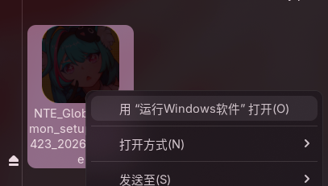
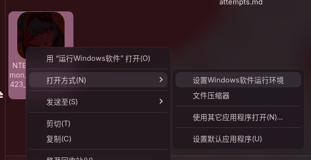
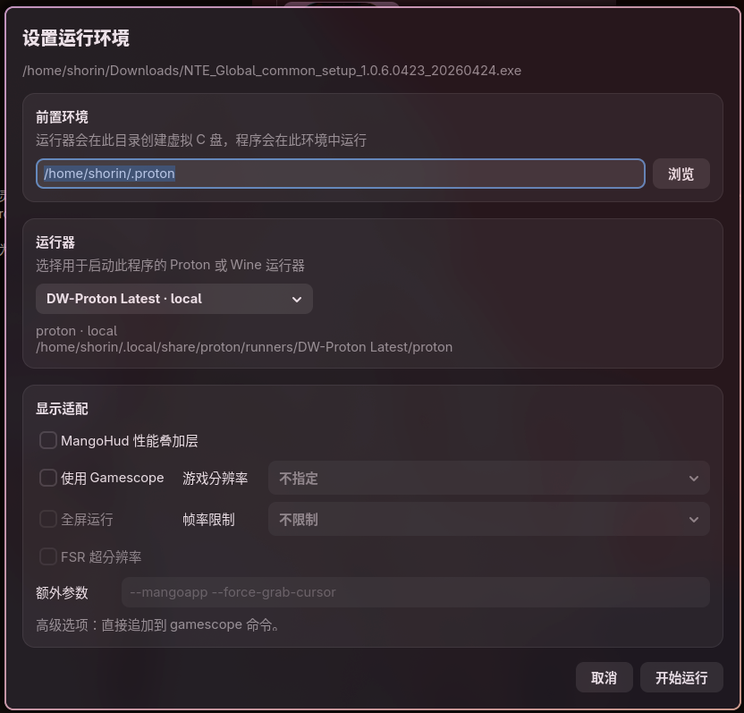
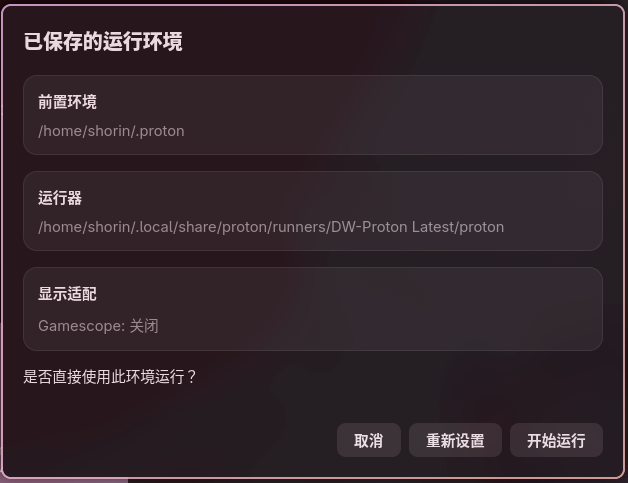
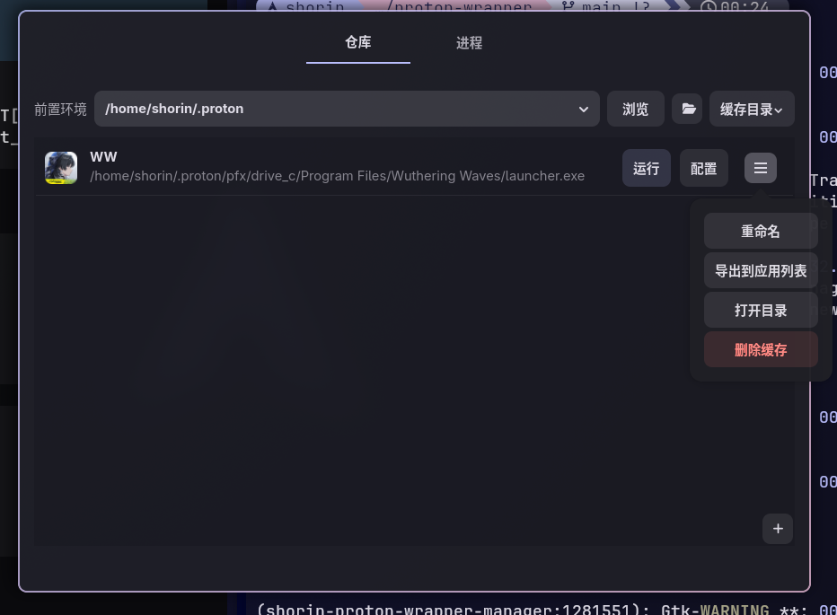
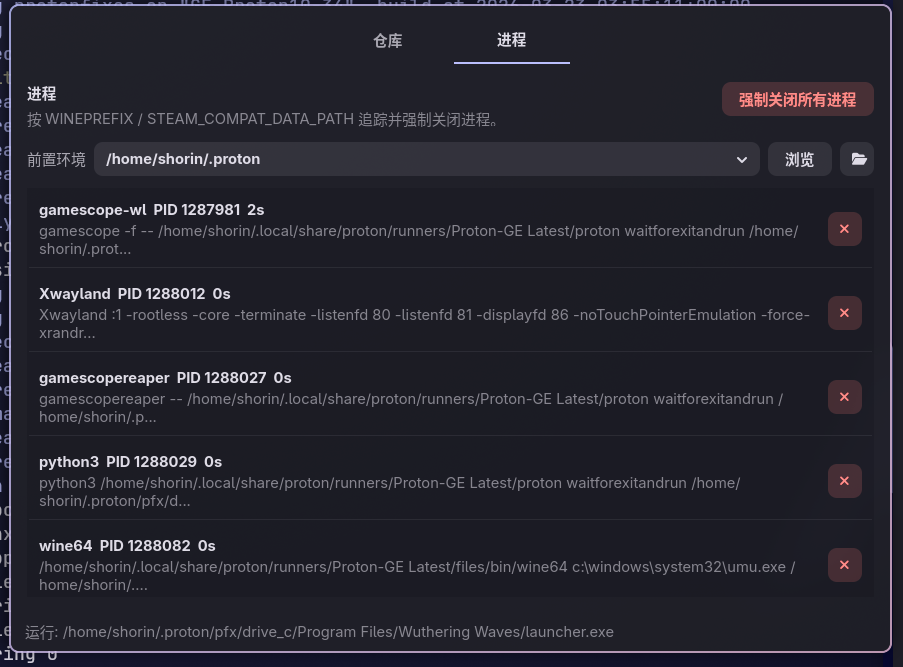

# proton-wrapper

一直以来，用 Proton 运行 exe 大多通过添加非 Steam 游戏或者Lutris的之类的方式，难以做到`双击直接运行`般无缝的交互体验，所以我制作了 `shorin-proton-wrapper`。最大的特点是安装后可以直接运行 exe，无须任何前置操作。



灵感来自 Wine 的配置过程。安装 WIne 后运行 `winecfg` 会在 `~/.wine` 目录初始化前置运行环境。我借鉴并改良了这个设计，运行 exe 的默认行为是检测 `~/.proton` 是否存在，如果不存在则静默初始化。考虑到国内二游盛行，我选择了 `DW-Proton` 作为默认运行器。

## 设置Widnows程序运行环境

>`shorin-proton-wrapper-configure`

为了兼顾自由度，我额外做了一个名为 `设置Windows程序运行环境` 的打开方式。支持自定义前置环境目录、Proton 版本、MangoHud 帧数/性能屏显、GameScope 合成器运行等常用设置项。





第一次设置之后会将设置项缓存至 `~/.cache/shorin-proton-wrapper`，以后使用 `运行Windows软件` 打开会自动读取缓存配置，如果再次用 `设置Windows软件运行环境` 打开，则会提示 `已保存的运行环境`，可自行决定要重新设置还是直接运行。



## Shorin Prton Wrapper 管理器

>`shorin-proton-wrapper-manager`

在每次运行 exe 都会自动进入管理器的仓库，通过 `icoextract` `python-pillow` 生成缩略图。支持导出趁虚到 Linux 应用菜单、重命名显示名称和 `.desktop` 名称、修改配置等功能。



在进程卡死或者后它进程无法退出的时候可以在进程页面强制退出。



## shorin-proton-wrapper

另外还提供了 CLI 工具方便从终端进行 Proton 管理、exe 运行等操作。

```
shorin-proton-wrapper 

用法:
  shorin-proton-wrapper [选项] app.exe [参数...]

选项:
  --init                  初始化，默认路径 ~/.proton
  -p, --prefix 目录       指定前置环境路径，若不存在则初始化
  --status                显示前置环境信息
  --list-runner           列出已安装的运行器
  --runner 路径|ge|dw     指定运行器
  --install ge|dw         安装运行器，默认安装至 ~/.local/share/proton/runners
  --install-steam ge|dw   给 Steam 安装运行器
  --install-lutris ge|dw  给 Lutris 安装运行器
  --download ge|dw        仅下载运行器，默认下载路径为 XDG 下载目录
  --list-version ge|dw    列出可使用的运行器版本
  --version 版本          指定特定版本，默认 latest
  --update                升级所有已安装的 Latest 运行器
  --remove ge|dw          移除默认位置中已安装的运行器
  --remove-steam ge|dw    移除 Steam 中指定运行器，省略 ge|dw 则移除全部由 wrapper 安装的运行器
  --remove-lutris ge|dw   移除 Lutris 中指定运行器，省略 ge|dw 则移除全部由 wrapper 安装的运行器
  --gs, --gamescope       用 Gamescope 运行。默认窗口化；需要自定义分辨率、帧率、FSR 或遇到显示兼容问题时使用
  --mangohud              启用 MangoHud 性能叠加层
  --debug                 将完整调试日志写入 ~/.cache/shorin-proton-wrapper/logs
  --help-full             显示完整说明

示例:
  shorin-proton-wrapper --init
  shorin-proton-wrapper /path/to/app.exe
  shorin-proton-wrapper --runner /path/to/proton /path/to/app.exe
  shorin-proton-wrapper -p /path/to/prefix /path/to/app.exe
  shorin-proton-wrapper --install dw
  shorin-proton-wrapper --install-steam dw
  shorin-proton-wrapper --download ge --version GE-Proton10-34
  shorin-proton-wrapper --gamescope --res 1920x1080 --fps 30 --fsr /path/to/app.exe
  shorin-proton-wrapper --debug /path/to/app.exe
  shorin-proton-wrapper --list-version dw
  shorin-proton-wrapper --update
```
```
shorin-proton-wrapper --gamescope 

用法:
  shorin-proton-wrapper --gamescope [Gamescope 选项] app.exe [参数...]

Gamescope 选项:
  --windowed             窗口模式 (默认)
  --fullscreen           全屏模式
  --res 宽x高            设置游戏渲染分辨率，例如 1920x1080
  --fps 帧率             限制帧率
  --fsr                  启用 FSR 超分辨率
  --args 参数            追加自定义 Gamescope 参数
  --mangohud             启用 MangoHud 性能叠加层
  -h, --help             显示本帮助

示例:
  shorin-proton-wrapper --gamescope --windowed --res 1920x1080 --fps 30 --fsr --mangohud game.exe
```
